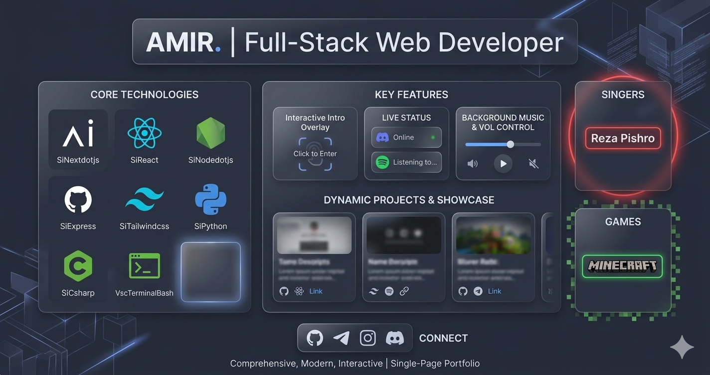

# 🌌 Amir | Full-Stack Web Developer Portfolio

An elegant, modern, and highly interactive premium portfolio website built using **Next.js (App Router)**, **Tailwind CSS**, and **Framer Motion**. Featuring a deep custom midnight-dark theme, live status tracking, and a clean, responsive layout.



---

## ✨ Features

* **🖥️ Ultra-Dark Midnight Theme:** A completely customized, rich pitch-black blue background matching a modern developer aesthetic.
* **📡 Real-Time Discord Status:** Dynamic API integration showcasing live activity presence (Online, Idle, DND) and active Spotify playback streams directly on the hero card.
* **⚔️ Dynamic Tech Arsenal:** Smoothly animated grid displaying an array of languages, full-stack frameworks, and networking skills with responsive flex-wrapping.
* **✉️ Secure Contact System:** A custom Next.js API route (`/api/contact`) configured for processing contact form submissions safely.
* **❄️ Atmospheric UI:** Built-in ambient background music configuration along with a fully integrated Framer Motion snowfall particle effect overlay.

---

## 🛠️ Tech Stack

* **Frontend:** Next.js 14+ (React), TypeScript, Tailwind CSS
* **Animations:** Framer Motion
* **Icons:** React Icons (`si`, `fa`, `vsc`)
* **Backend Capabilities:** Next.js Serverless API Routes
* **Server/Deployment:** Node.js custom server production layer

---

## 🚀 Getting Started

### 1. Clone & Install Dependencies

First, navigate into your project directory and install the required modules:

```bash
npm install